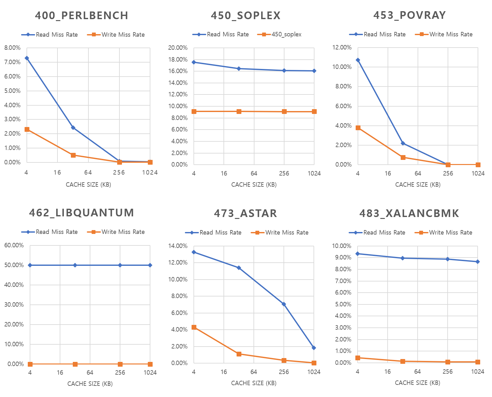
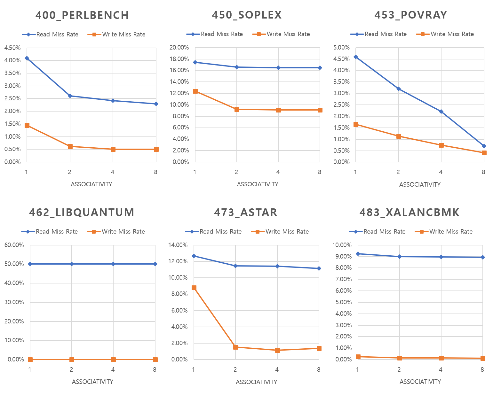
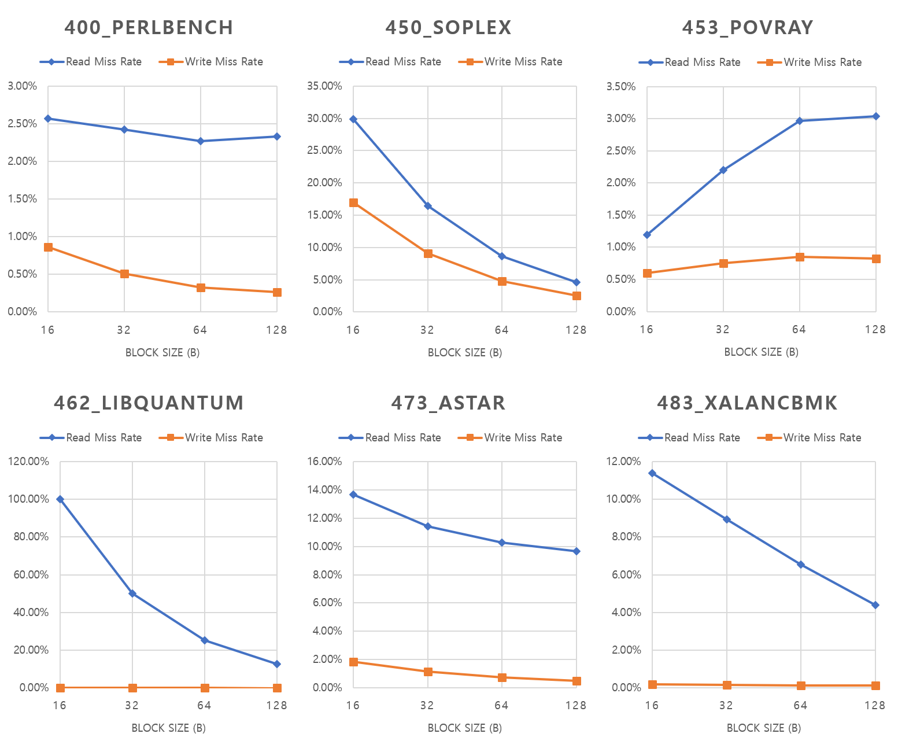

# Single-level Cache Simulator

Author : 201711200 함어진 ([ham@dgist.ac.kr](mailto:ham@dgist.ac.kr))

This project is based on Project 4: Cache Model and Performance Analysis from *Introduction to Computer Architecture (SE379)*.


## Introduction

이번 과제에서는 단일 단계의 캐시를 시뮬레이팅 할 수 있는 프로그램을 구현하였고, 구현한 캐시로 트레이스 파일을 처리한 결과를 통해 Cache Size, Block Size, Associativity에 따라 Miss Rate가 어떻게 변화하는지 분석하였다. 과제는 Windows Subsystem for Linux의 Ubuntu 18.04.1 LTS 환경에서 개발 및 테스트 되어졌다.


이 과제에서 컨트롤 할 수 있는 캐시의 특성은 다음과 같다

- cache size : 4~1024 KB
- associativity : 1~4 ways
- block size : 16~128 B


이 과제에서 구현된 캐시는 다음과 같은 특성을 갖고 있다.

- single level cache
- write-back방식의 메모리 접근법을 사용.
  - dirty bit이 1인 block을 write할 때만 memory에 접근
- block eviction policy로 LRU(least recently used)를 사용


## How to Run

첨부된 파일의 압축을 푼 후 배시로 해당위치에 접근한다. `*.out`확장자의 트레이스 파일 `<trace file>`을 아래의 배시코드에 맞추어 입력하면 트레이스 파일에 맞춰 실행한 cache의 상태를 .`<trace file name>_<capacity>_<associativity>_<block_size>.out`의 파일로 저장하며, 그 내용을 배시에 출력한다.

```bash
$ python3 ./cache_simulator.py <-c capacity> <-a associativity> <-b block_size> <trace file>
```

아래 3개의 변수는 실행시 무조건 설정하여야 한다.

- `-c` : capacity로써 cache의 data field의 용량을 KB단위로 적는다.
- `-a` : associativity로써 cache 내 way의 갯수를 적는다.
- `-b` : 블록 하나의 크기를 B단위로 적는다. 


## Output Form

아래는 과제의 예시로 주어진 트레이스 파일 `453_povray.out`을 실행하였을 때 출력 및 저장한 내용을 보여준다.

```bash
$ python3 ./cache_simulator.py -c 32 -a 4 -b 32 453_povray.out
```

위의 bash 코드를 실행했을 때 보여주는 결과는 아래와 같다.

```notepad
-- General Stats --
Capacity: 32
Way: 4
Block size: 32
Total accesses: 20000001
Read accesses: 13743231
Write accesses: 6256770
Read misses: 302566
Write misses: 46857
Read miss rate: 2.2015638098493726%
Write miss rate: 0.7489007906635532%
Clean evictions: 279132
Dirty evictions: 69518
Checksum: 0x3c8075
```


## Statistical Results

문제에서 주어진 여섯개의 워크로드 (`400_perlbench`, `450_soplex`, `453_povray`, `462_libquantum`, `473_astar`, `483_xalancbmk`)에 대한 트레이스 파일의 실행결과이다. 세 개의 parameter를 조절하였을 때 read,  write miss rates가 어떻게 변화하는지 소개하고자 한다. 아래 그래프에서는 eviction에 대한 분석은 진행하지 않아 각 워크로드에 대한 temporal locality를 유추하지는 않았다.


### Capacity

32B의 block size를 갖고 있는 4-way set associative cache에서 4~1024KB의 범위 내에서 cache size를 변화하였을 때 여섯개의 워크로드를 실행한 결과는 아래와 같다.



Capacity가 늘어남에 따라 miss rate는 감소하는 것이 맞다. 그러나 워크로드에 따라 감소하는 폭(기울기)에 있어 그 차이를 보인다. 400, 453, 473의 경우 매우 큰 폭으로 miss rate가 감소하는 반면, 나머지는 거의 변화가 없다. Cache의 용량에 따라 miss율이 매우 크게 감소하는 워크로드의 경우 working set(접근하는 데이터의 범위) 가 매우 크다는 것을 암시할 수 있다. 거의 0으로 수렴하는 경우 cache가 working set을 모두 포함한다는 것이다. 반면, cache의 용량 대비 miss 감소가 크지 않은 워크로드는 애초에 working set의 크기가 작기 때문이라는 것을 예측할 수 있다. 예를 들어, 462의 경우에는 변화가 존재하지 않는데, 이는 working set의 양이 극단적으로 적기 때무에 좁은 영역의 데이터를 지속적으로 접근하는 워크로드임을 유추할 수 있다.


### Associativity

32B의 block size와 32KB의 data를 저장할 수 있는 cache에서 associativity를 1~8로 바꿀때 여섯개의 워크로드를 실행한 결과는 아래와 같다.



본 과제에서 구현한 Set Associative 구조의 cache는 여러 way 중 non-valid entry를 가능한 업데이트 하며, 모든 way가 valid한 경우 LRU의 규칙에 따라 가장 오래 동안 사용하지 않은 way의 block에 대해 eviction을 실행한다. 그러므로, associativity(way의 갯수)가 클 수록 eviction을 감소시킬 수 있다.

여섯개의 트레이스 파일에서 Read Miss Rate와 Write Miss Rate는 Associativity가 증가할수록 일정하거나 감소하는 경향을 보인다. 그러나 0이 되지 않는 경우가 존재하는데, 이는 fully associative에 가깝게 way를 늘려도 공간이 부족하여 capacity miss가 발생하여 벌어지는 현상일 가능성이 있다. 462의 경우에는 거의 감소가 없는데, spatial locality가 극적으로 크기 때문에 associativity가 아무리 늘어나도 miss rate가 거의 줄어들지 않는 것이다.

여기서는 고려되지 않지만 Associativity가 높을수록 latency가 증가하기 때문에, 400와 473의 경우 miss rate의 감소폭이 가장 큰 2-way set associative cache가 가장 효율적인 아키텍쳐일 것이다.


### Block Size

32KB의 data를 저장할 수 있는 4-way set associative cache에서 16~128B의 범위 내에서 block size를 변화하였을 때 여섯개의 워크로드를 실행한 결과는 아래와 같다.



Block size가 커진다면 spatial locality에 대한 이득을 크게 볼 수 있다. 그러나 cache size가 고정된 경우 block size가 커짐에 따라 set의 갯수(한 way에 있어 block의 수)는 감소하게 되어 오히려 conflict가 발생할 가능성을 늘린다. 여기서는 고려되지 않지만 block size에 따라 miss시 main memory로부터 불러오는 양이 크므로 miss penalty도 같이 커지게 된다.

450, 562, 473, 483 워크로드의 경우 miss rate가 block size에 따라 감소하는 경향이 크고, 453와 400 워크로드의 경우 block size에 따라 miss rate가 증가하거나 감소하는 경우를 모두 볼 수 있다. 감소율이 큰 450, 562, 473, 483 워크로드의 경우 spatial locality의 이득을 매우 크게 받음(spatial locality가 커서 miss rate가 줄어듬)을 알 수 있고, 감소율이 적은 453와 400 워크로드는 그렇지 못함을 알 수 있다. 이와 같이 증가하는 양상의 이유는 conflict로 추정할 수 있을 것이다. Cache size와 associativity를 변화시켜도 miss rate가 줄지 않던 462 워크로드의 경우, spatial locality가 매우 높아 효과적으로 감소하는 것을 볼 수 있다. 453의 경우 16B 이하, 나머지는 128B 이상의 block size를 사용하는 것이 read, write miss rate를 최소화 할 수 있는 방법이 될 것이다.


## Acknowledgements

Cache에 대해 많은 지식을 알려준 DGIST 기초학부 17학번 하현욱, 윤형근, 이승민에게 감사의 말씀을 드립니다.
